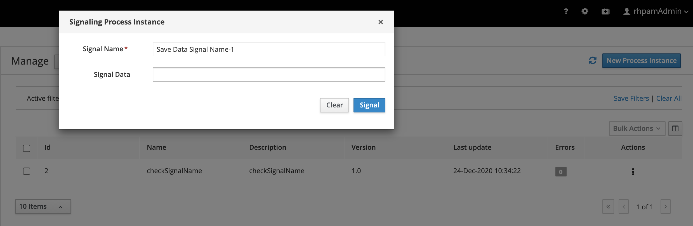

Changing the human task status to failed and seeting the error path
===================================================================

This exmaple provides inforamtion about, how to make human task status as failed and diverting the process flow to error path.

In this example we are using signal to set the process variables which will be used to decide the error path of process flow.

Post deploying the kJar follow the the below steps.

  * Step 1: Create a process instance for [human-signal](src/main/resources/com/temenos/human_signal/human-signal.bpmn)
  * Step 2: Claim and work on human task. 
  * Step 3: Start button will make the human task status to 'inprogress'
  * Step 4: Signal process case instance with signal name (i.e. errorSignal) and "failed" as data to signal. 
   
  * Step 5: Observe the process varables. Now we can observe the process varaible status value as failed.
   
  * Step 6: Use the below REST Api to change the status of the human task to "failed"
   
  * Step 7: Observe the process diagram.
   

Preparing and Assigning the Signal name dynamically
====================================================

This exmaple provides inforamtion about, how to prepare and assign the signal name dynamically.

In this example we are using Node name and Node id combination to set the signal name.

Observe the process design
   * Human task on entry script
   
      String id = ((WorkItemNodeInstance)kcontext.getNodeInstance()).getNodeName() + "-" + ((WorkItemNodeInstance)kcontext.getNodeInstance()).getId();
      System.out.println(" SignalName [" + id + "]");
      kcontext.setVariable("signalName", id);
      
   Refer the [WorkItemNodeInstance API](https://docs.jboss.org/jbpm/v5.4/javadocs/org/jbpm/workflow/instance/node/WorkItemNodeInstance.html) to prepare various combinations of signal names. Make sure signal name is unique across the process.
   
   
   
   * Signal Name assignment
   

Post deploying the kJar follow the the below steps.

  * Step 1: Create a process instance for [checkSignalName](src/main/resources/com/temenos/human_signal/checkSignalName.bpmn)
  * Step 2: Observe the signal name in console.
   
   
  * Step 2: Claim and work on human task. 
  * Step 3: Start button will make the human task status to 'inprogress'
  * Step 4: Signal the with dynamic name. 
   
  * Step 5: Observe the process diagram.
   
